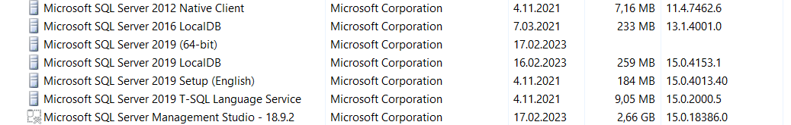
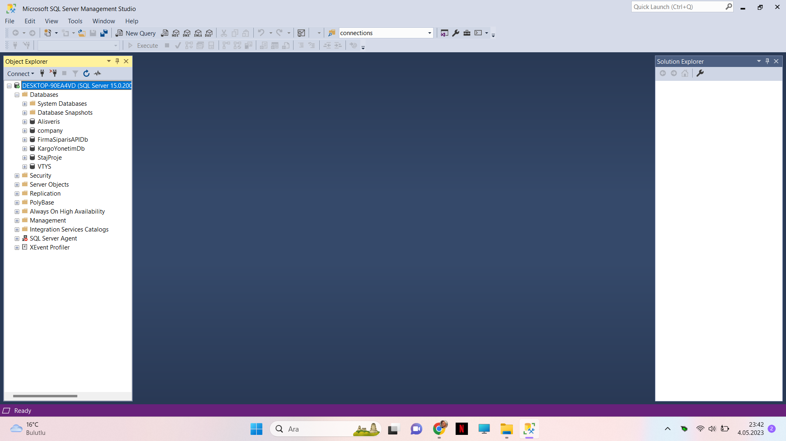
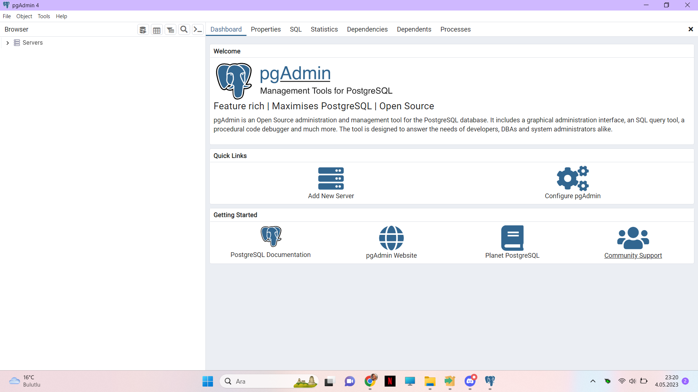
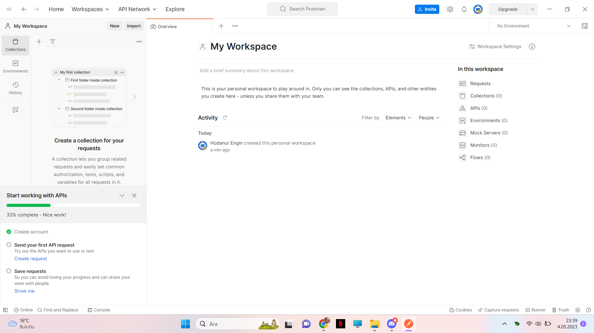
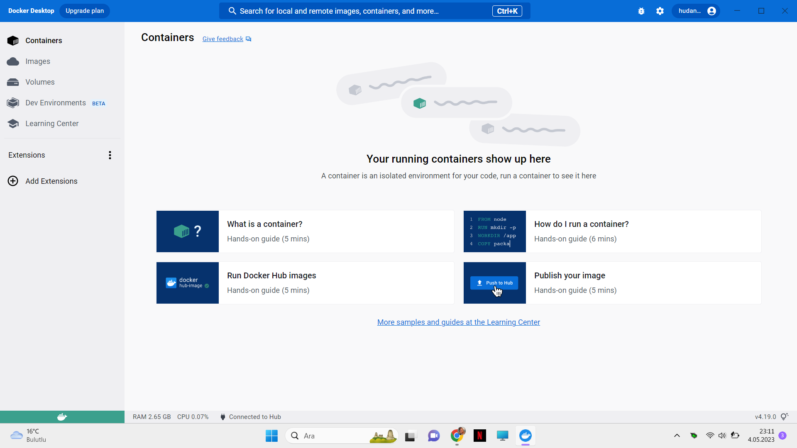

# Assignment Week1
<ol> 
<li><h2>Veritabani kurulumlari:</h2></li>
<ol>
<li> MSSQL Server</li>

  

<li> PostgreSQL(Docker uzerine veya bilgisayariniza) </li>

  

</ol>
<li><h2>Veritabani yonetim araci kurulumlari:</h2></li>
<ol>
<li> MSSQL Managment Studio</li>
  
  
  
<li> PgAdmin4 veya DBeaver </li>
  
  
  
</ol>
<li><h2>Diger uygulamalar:</h2></li>
<ol>
<li> Postman</li>
  
  
  
<li> Docker (Sonraki haftalarda kullanılacak) </li>
  
  
  
</ol>

Bu hafta bir kod odevi yok, kurulumlarin yapildigina dair ekran ciktisi koymaniz yeterli .
